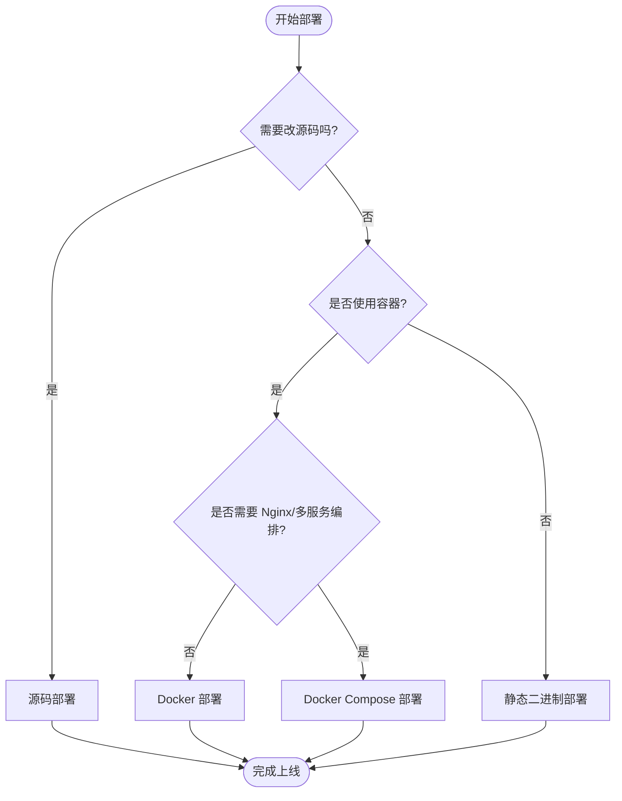
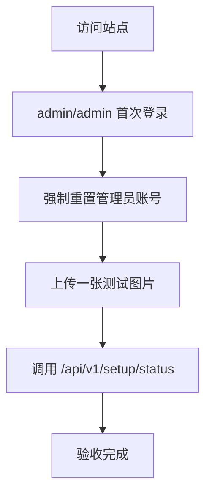

本章按「从轻到重」给出 4 套部署方案，便于你根据环境选择：

1. 源码部署（适合二次开发）
2. Docker 部署（适合快速上线单机）
3. Docker Compose 部署（适合标准化生产环境）
4. 静态二进制部署（适合极简运维）

## 部署决策流程



## 通用前置条件

- 域名已解析到服务器（生产推荐）
- 开放端口：`80`/`443`（反向代理场景）或 `8080`（直连场景）
- 数据目录可持久化（至少包含数据库与上传文件）
- 建议最小规格：`1 vCPU / 1 GB RAM / 20 GB SSD`

::tip
无论采用哪种方式，都建议把数据目录单独挂载到独立磁盘或定期备份。
::

## 方案一：源码部署

适用场景：需要定制功能、二次开发、调试内部逻辑。

### 1. 安装依赖

- Go `1.25+`
- Node.js `22+`
- GNU Make

### 2. 拉取并构建

```bash
git clone https://github.com/amigoer/kite.git
cd kite
make build
```

产物默认位于 `build/kite`。

### 3. 配置并启动

```bash
export GIN_MODE=release
export KITE_HOST=0.0.0.0
export KITE_PORT=8080
export KITE_DB_DRIVER=sqlite
export KITE_DSN=./data/kite.db
export KITE_SITE_URL=https://kite.example.com

./build/kite
```

### 4. systemd 托管（推荐）

```ini
[Unit]
Description=Kite Service
After=network.target

[Service]
WorkingDirectory=/opt/kite
ExecStart=/opt/kite/kite
Restart=always
RestartSec=5
Environment=GIN_MODE=release
Environment=KITE_HOST=0.0.0.0
Environment=KITE_PORT=8080
Environment=KITE_DB_DRIVER=sqlite
Environment=KITE_DSN=/opt/kite/data/kite.db
Environment=KITE_SITE_URL=https://kite.example.com

[Install]
WantedBy=multi-user.target
```

## 方案二：Docker 部署

适用场景：单机快速上线，运维简单。


### 1. 启动容器

```bash
docker run -d \
  --name kite \
  -p 8080:8080 \
  -e GIN_MODE=release \
  -e KITE_SITE_URL=https://kite.example.com \
  -e KITE_DB_DRIVER=sqlite \
  -e KITE_DSN=/app/data/kite.db \
  -v /opt/kite/data:/app/data \
  --restart unless-stopped \
  amigoer/kite:latest
```

### 2. 健康检查

```bash
curl http://127.0.0.1:8080/api/v1/setup/status
docker logs --tail=100 kite
```

## 方案三：Docker Compose 部署

适用场景：生产推荐，Kite + Nginx + 证书续期等多服务管理。

## 目录结构

```
/opt/kite
├── docker-compose.yml
├── data/                     # Kite 数据目录（SQLite + uploads）
└── nginx/
    ├── conf.d/
    │   └── kite.conf
    ├── ssl/
    │   ├── fullchain.pem
    │   └── privkey.pem
    ├── logs/
    └── www/                  # Certbot ACME webroot
```

## `docker-compose.yml`

创建 `/opt/kite/docker-compose.yml`：

```yaml
services:
  kite:
    image: amigoer/kite:latest
    container_name: kite
    restart: unless-stopped
    expose:
      - "8080"
    environment:
      KITE_HOST: 0.0.0.0
      KITE_PORT: "8080"
      KITE_DB_DRIVER: sqlite
      KITE_DSN: /app/data/kite.db
      KITE_SITE_URL: https://kite.your-domain.com
      GIN_MODE: release
      TZ: Asia/Shanghai
    volumes:
      - ./data:/app/data
    networks:
      - kite-net
    healthcheck:
      test: ["CMD", "wget", "-qO-", "http://127.0.0.1:8080/api/v1/setup/status"]
      interval: 30s
      timeout: 5s
      start_period: 10s
      retries: 3

  nginx:
    image: nginx:1.27-alpine
    container_name: kite-nginx
    restart: unless-stopped
    ports:
      - "80:80"
      - "443:443"
    volumes:
      - ./nginx/conf.d:/etc/nginx/conf.d:ro
      - ./nginx/ssl:/etc/nginx/ssl:ro
      - ./nginx/logs:/var/log/nginx
      - ./nginx/www:/var/www/certbot
    depends_on:
      kite:
        condition: service_healthy
    networks:
      - kite-net

networks:
  kite-net:
    driver: bridge
```

### 启动

```bash
cd /opt/kite
docker compose up -d
docker compose ps
```

## `kite.conf`（Nginx）

创建 `/opt/kite/nginx/conf.d/kite.conf`：

```nginx
upstream kite_backend {
    server kite:8080;
}

# HTTP → HTTPS 重定向 + Certbot 挑战
server {
    listen 80;
    server_name kite.your-domain.com;

    location /.well-known/acme-challenge/ {
        root /var/www/certbot;
    }

    location / {
        return 301 https://$host$request_uri;
    }
}

# HTTPS 主站点
server {
    listen 443 ssl http2;
    server_name kite.your-domain.com;

    ssl_certificate     /etc/nginx/ssl/fullchain.pem;
    ssl_certificate_key /etc/nginx/ssl/privkey.pem;
    ssl_protocols       TLSv1.2 TLSv1.3;
    ssl_ciphers         HIGH:!aNULL:!MD5;

    # 上传体积限制 —— 需 ≥ Kite 的 max_file_size
    client_max_body_size 200m;
    client_body_timeout  300s;
    proxy_read_timeout   300s;

    location / {
        proxy_pass         http://kite_backend;
        proxy_set_header   Host              $host;
        proxy_set_header   X-Real-IP         $remote_addr;
        proxy_set_header   X-Forwarded-For   $proxy_add_x_forwarded_for;
        proxy_set_header   X-Forwarded-Proto $scheme;
        proxy_http_version 1.1;
    }

    # 文件短链（/i/* /v/* /a/* /f/* /t/*）长缓存
    location ~ ^/(i|v|a|f|t)/ {
        proxy_pass         http://kite_backend;
        proxy_set_header   Host              $host;
        proxy_set_header   X-Forwarded-For   $proxy_add_x_forwarded_for;
        proxy_set_header   X-Forwarded-Proto $scheme;
        proxy_http_version 1.1;

        proxy_cache_valid      200 30d;
        add_header  Cache-Control "public, max-age=2592000, immutable";
    }
}
```

  ## TLS 证书（Let's Encrypt）

首次启动前，需要先拿到 Let's Encrypt 证书。最简单的方式是使用 **certbot** 的 standalone 模式（临时关闭 Nginx）：

```bash
sudo certbot certonly --standalone \
  -d kite.your-domain.com \
  --email you@example.com \
  --agree-tos --no-eff-email

sudo cp /etc/letsencrypt/live/kite.your-domain.com/fullchain.pem /opt/kite/nginx/ssl/
sudo cp /etc/letsencrypt/live/kite.your-domain.com/privkey.pem   /opt/kite/nginx/ssl/
```

### 自动续期（Compose 场景）

在 Crontab 中添加（每月 1 日凌晨续期）：

```cron
0 3 1 * * certbot renew --webroot -w /opt/kite/nginx/www --deploy-hook "docker exec kite-nginx nginx -s reload"
```

## 方案四：静态二进制部署

适用场景：极简运维、离线网络、无需容器环境。


### 1. 下载并解压

```bash
mkdir -p /opt/kite && cd /opt/kite
curl -LO https://github.com/amigoer/kite/releases/latest/download/kite-linux-amd64.tar.gz
tar -xzf kite-linux-amd64.tar.gz
chmod +x kite
```

### 2. 创建目录并启动

```bash
mkdir -p /opt/kite/data
export GIN_MODE=release
export KITE_HOST=0.0.0.0
export KITE_PORT=8080
export KITE_DB_DRIVER=sqlite
export KITE_DSN=/opt/kite/data/kite.db
export KITE_SITE_URL=https://kite.example.com

./kite
```

### 3. 建议接入反向代理

生产建议通过 Nginx/Caddy 暴露 `443`，并把 `Host` 与 `X-Forwarded-Proto` 传递给 Kite。

## 首次初始化与验收



验收检查清单：

1. 能正常登录后台并重置默认管理员账号
2. 上传图片成功，返回短链可访问
3. `GET /api/v1/setup/status` 返回 `initialized: true`
4. 数据目录有 `kite.db` 与上传文件
5. 重启进程/容器后数据仍在

## 备份与恢复

```bash
# 完整备份（SQLite + 本地文件）
tar -czf kite-backup-$(date +%F).tar.gz -C /opt/kite data

# 仅数据库备份（文件在 S3 时）
cp /opt/kite/data/kite.db /opt/kite/kite-$(date +%F).db
```

## 容量规划

| 部署形态 | 典型适用规模 | 注意点 |
|---------|-------------|--------|
| SQLite + 本地存储 | 单机、≤ 10 万文件 | 备份即复制 `data/` 目录 |
| SQLite + S3 | 单机、百万级文件 | 数据库仍在单机，文件无限扩展 |
| MySQL/PG + S3 | 多实例、大规模 | 共享数据库 + 对象存储，水平扩展 |

## 监控与告警

`GET /api/v1/setup/status` 是一个轻量的健康检查端点：

```bash
curl https://kite.your-domain.com/api/v1/setup/status
# {"code":0,"message":"success","data":{"initialized":true}}
```

Docker healthcheck 已默认使用它。接入 Uptime Kuma / Grafana 时，建议同时监控：

- `/api/v1/setup/status`（应用可用性）
- 反向代理 `5xx` 比例（网关健康）
- 磁盘剩余空间（避免 `50700`）

## 下一步

- [第三方客户端](/docs/guide/clients) · 接入 PicGo、ShareX
- [API 参考](/docs/api/overview) · 自定义上传集成
