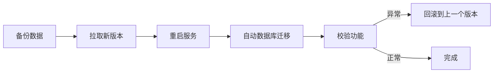
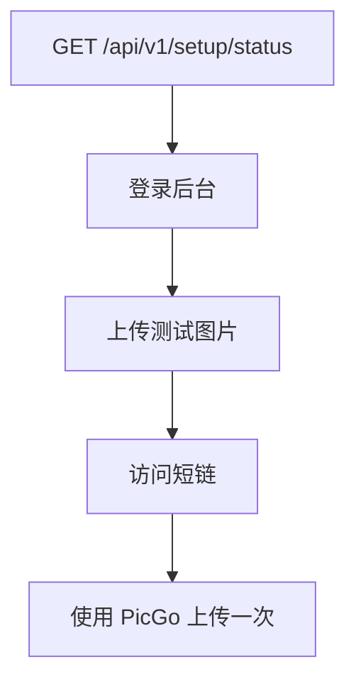

Kite 遵循语义化版本（[SemVer](https://semver.org/lang/zh-CN/)），发布节奏以 [GitHub Releases](https://github.com/kite-plus/kite/releases) 为准。每次升级推荐按**备份 → 升级 → 校验 → 回滚预案**的顺序执行。

## 升级流程总览



::tip
Kite 每次启动都会通过 GORM 的 `AutoMigrate` 自动建表与补列，无需手动执行迁移脚本。但你仍应在升级前做一次完整备份。
::

## 升级前检查

1. 查看 [Releases](https://github.com/kite-plus/kite/releases) 的变更日志，特别关注：
   - **Breaking changes**（通常见于主版本号变更）
   - 新增的环境变量默认值
   - 配置 / 存储策略的兼容性说明
2. 确认当前版本号，便于出现问题时回滚：

```bash
# Docker
docker inspect --format='{{.Config.Image}}' kite

# 二进制
./kite -v    # 或 ./kite version（视版本而定）
```

3. 确认下述路径与权限仍然可用：
   - 数据目录（SQLite 与本地上传文件）
   - 对象存储凭证仍然有效
   - 反向代理的证书未过期

## 备份数据

无论采用哪种部署方式，升级前都**强烈建议**完整备份数据目录与数据库。

### SQLite + 本地存储

```bash
# 打包整个 data 目录（含 kite.db、uploads/、thumbnails/）
tar -czf kite-backup-$(date +%F-%H%M).tar.gz -C /opt/kite data
```

### MySQL / PostgreSQL

```bash
# MySQL
mysqldump -u kite -p kite > kite-$(date +%F).sql

# PostgreSQL
pg_dump -U kite kite > kite-$(date +%F).sql
```

### 仅数据库（文件托管在 S3 时）

```bash
cp /opt/kite/data/kite.db /opt/kite/kite-$(date +%F).db
```

::warning
升级**有状态服务**时，数据库备份与对象存储的时间戳应尽可能一致，否则回滚后可能出现「数据库有记录但 S3 没对应文件」的孤立引用。
::

## 方案一：Docker 升级

```bash
# 1. 拉取新镜像
docker pull amigoer/kite:latest

# 2. 停止并删除旧容器（数据目录通过 -v 持久化，不会丢失）
docker stop kite && docker rm kite

# 3. 用相同参数启动新容器
docker run -d \
  --name kite \
  -p 8080:8080 \
  -v /opt/kite/data:/app/data \
  -e GIN_MODE=release \
  -e KITE_SITE_URL=https://kite.example.com \
  --restart unless-stopped \
  amigoer/kite:latest

# 4. 观察启动日志
docker logs -f --tail=100 kite
```

::note
建议在生产环境使用**具体版本标签**（如 `amigoer/kite:v0.1.5`）而非 `latest`，避免下一次重建容器时被意外升级。
::

## 方案二：Docker Compose 升级

如果你按照 [生产部署](/docs/guide/deployment) 使用 Compose，升级只需两条命令：

```bash
cd /opt/kite
docker compose pull kite
docker compose up -d kite
```

Compose 会用新镜像重建 Kite 容器；Nginx 等依赖服务不受影响。若 `docker-compose.yml` 中 Kite 使用了固定版本号，先编辑版本后再执行：

```yaml
services:
  kite:
    image: amigoer/kite:v0.1.5   # 改成要升级的版本
```

然后：

```bash
docker compose up -d kite
docker compose ps
```

## 方案三：二进制升级

```bash
cd /opt/kite

# 1. 下载新版本到临时路径
curl -L -o kite.new \
  https://github.com/kite-plus/kite/releases/latest/download/kite-linux-amd64.tar.gz
tar -xzf kite.new kite -O > kite.next
chmod +x kite.next

# 2. 停止当前服务
sudo systemctl stop kite

# 3. 原地替换（保留旧版本以便回滚）
mv kite kite.prev && mv kite.next kite

# 4. 启动并查看日志
sudo systemctl start kite
sudo journalctl -u kite -f --since="1 min ago"
```

::tip
保留至少一个历史版本（如上例中的 `kite.prev`），可以在出问题时**秒级回滚**。
::

## 方案四：源码升级

```bash
cd /path/to/kite
git fetch --tags
git checkout v0.1.5       # 切到目标 tag，避免跟随主分支

make build
sudo systemctl restart kite
```

若仅升级依赖：

```bash
go mod tidy
cd web && pnpm install && cd -
make build
```

## 数据库迁移

Kite 采用 GORM `AutoMigrate`，首次启动新版本时会：

1. 对比结构体与数据库的列差异
2. 自动**新增列**、创建新表与索引
3. **不会** 删除已有列或修改类型（避免数据丢失）

| 场景 | 行为 |
|------|------|
| 新增字段 | 启动时自动补列 |
| 新增表 | 启动时自动创建 |
| 字段改名 | **不会**自动重命名，需在 Release Notes 中说明人工操作 |
| 字段删除 | **不会**删除，表结构会出现「冗余列」，不影响使用 |

::warning
若某次升级的 Release Notes 标注了「**需要手动迁移**」，请严格按其中的 SQL 脚本执行，且**先备份再迁移**。
::

## 升级后校验

升级完成后按以下清单快速验收：



验收清单：

1. `curl https://kite.example.com/api/v1/setup/status` 返回 `initialized: true`
2. 后台登录正常，已有相册、文件、Token 全部可见
3. 上传新图片得到的短链可在浏览器中打开
4. 原有第三方客户端（PicGo、ShareX 等）无需改动仍可正常上传
5. 日志中没有出现 `ERROR` 或 `panic`

## 回滚

若新版本出现严重问题，按部署方式回滚即可。**回滚前务必同步恢复数据库备份**，否则可能因旧代码无法识别新字段而出错。

### Docker

```bash
docker stop kite && docker rm kite

docker run -d \
  --name kite \
  -p 8080:8080 \
  -v /opt/kite/data:/app/data \
  --restart unless-stopped \
  amigoer/kite:v0.1.4    # 回到上一个稳定版本
```

### Docker Compose

编辑 `docker-compose.yml` 中的 `image` 标签为上一个版本，然后：

```bash
docker compose up -d kite
```

### 二进制

```bash
sudo systemctl stop kite
mv /opt/kite/kite /opt/kite/kite.bad
mv /opt/kite/kite.prev /opt/kite/kite
sudo systemctl start kite
```

### 数据库回滚

```bash
# SQLite
systemctl stop kite
cp /opt/kite/kite-YYYY-MM-DD.db /opt/kite/data/kite.db
systemctl start kite

# MySQL / PostgreSQL
mysql -u kite -p kite < kite-YYYY-MM-DD.sql
```

## 常见问题

### 升级后无法启动，日志提示「表结构不匹配」

通常是 Release Notes 中标注了手动迁移但被跳过。请：

1. 回滚到旧版本
2. 按 Release Notes 执行 SQL 手动迁移
3. 再次升级

### 升级后短链全部 404

检查反向代理是否改动了 `Host` / `X-Forwarded-Proto` 头；并确认 `KITE_SITE_URL` 与实际域名一致。

### 新字段默认值异常

如上传体积限制、默认相册配置等。部分运行时配置存储在数据库的 `settings` 表中，新版本可能新增字段但默认值依旧生效。前往**后台 → 系统设置**检查即可。

### 配置不兼容

若 Release Notes 标注了某个环境变量被重命名或移除，请在升级前更新 systemd unit 文件或 `docker-compose.yml`，**避免用错误的配置启动新版本**。

## 订阅更新

- **GitHub Releases**：<https://github.com/kite-plus/kite/releases.atom> 可直接订阅 RSS
- **Watch 仓库**：在仓库主页点 **Watch → Custom → Releases**
- 站点首页与左上角版本徽标会在构建时读取最新 release

## 下一步

- [备份与恢复](/docs/guide/deployment#备份与恢复) · 建立日常备份策略
- [生产部署](/docs/guide/deployment) · 反向代理与 systemd 完整配置
- [API Token](/docs/api/tokens) · 升级后轮换 Token 的建议
