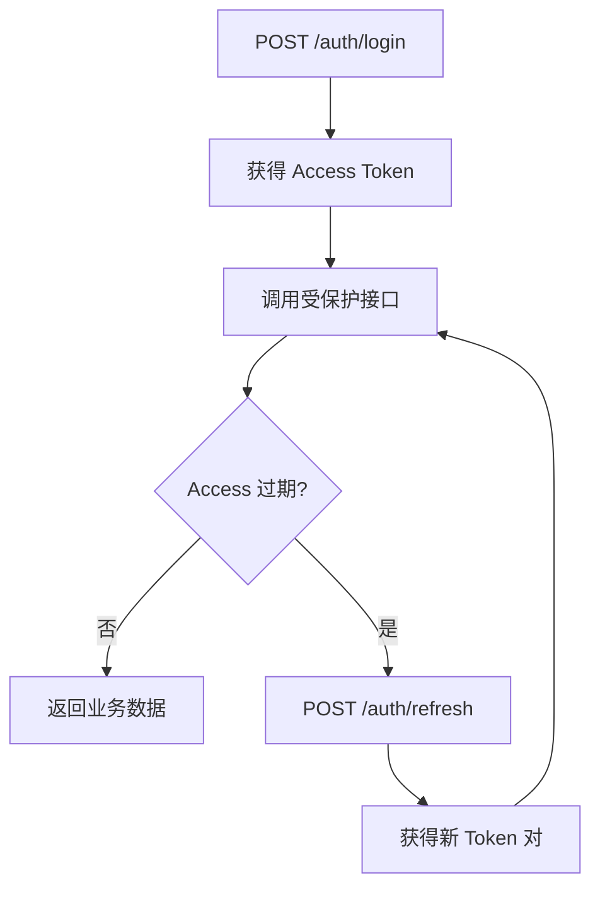

## 认证流程



## 登录

::endpoint
POST · `/api/v1/auth/login`
::

无需认证。成功时返回一对 Access/Refresh Token，并在 Cookie 中写入 `access_token`。

### 请求

```json
{
  "username": "alice",
  "password": "secret123"
}
```

| 字段 | 类型 | 必填 | 说明 |
|------|------|------|------|
| `username` | string | ✓ | 用户名或邮箱 |
| `password` | string | ✓ | 密码 |

### 响应

```json
{
  "code": 0,
  "message": "success",
  "data": {
    "access_token": "eyJhbGciOi...",
    "refresh_token": "eyJhbGciOi...",
    "expires_in": 7200,
    "token_type": "Bearer",
    "user": {
      "id": "uuid",
      "username": "alice",
      "email": "alice@example.com",
      "role": "user",
      "password_must_change": false
    }
  }
}
```

### 错误

| Code | 条件 |
|------|------|
| `40100` | 用户名或密码错误 |
| `40100` | 账号已被禁用 |

## 注册

::endpoint
POST · `/api/v1/auth/register`
::

仅当 `allow_registration = true` 时可用。

### 请求

```json
{
  "username": "bob",
  "email": "bob@example.com",
  "password": "strong-pass"
}
```

| 字段 | 约束 |
|------|------|
| `username` | 3-32 字符 |
| `email` | RFC 邮箱 |
| `password` | 6-64 字符 |

### 错误

| Code | 条件 |
|------|------|
| `40300` | 注册已关闭 |
| `40900` | 用户名/邮箱已存在 |

## 刷新 Token

::endpoint
POST · `/api/v1/auth/refresh`
::

使用 Refresh Token 换取新的 Access Token，无需再次登录。

### 请求

```json
{
  "refresh_token": "eyJhbGciOi..."
}
```

### 响应

响应格式与登录相同，返回全新的 Access/Refresh Token 对。

## 登出

::endpoint
POST · `/api/v1/auth/logout` · **需认证**
::

使当前 Token 失效并清除 Cookie。

```json
{ "code": 0, "message": "success", "data": null }
```

## 获取个人资料

::endpoint
GET · `/api/v1/profile` · **需认证**
::

### 响应

```json
{
  "code": 0,
  "data": {
    "id": "uuid",
    "username": "alice",
    "nickname": "Alice",
    "email": "alice@example.com",
    "avatar_url": "https://...",
    "role": "user",
    "storage_limit": 10737418240,
    "storage_used": 521308864,
    "is_active": true,
    "created_at": "2026-01-01T00:00:00Z"
  }
}
```

## 更新个人资料

::endpoint
PUT · `/api/v1/profile` · **需认证**
::

### 请求

```json
{
  "nickname": "Alice Liu",
  "email": "alice@new.example.com",
  "avatar_url": "https://..."
}
```

所有字段可选，仅传入想修改的字段。

## 修改密码

::endpoint
POST · `/api/v1/auth/change-password` · **需认证**
::

### 请求

```json
{
  "old_password": "secret123",
  "new_password": "stronger-pass"
}
```

## 首次登录重置

::endpoint
POST · `/api/v1/auth/first-login-reset` · **需认证**
::

专用于**默认管理员**首次登录后修改用户名与密码。调用成功后 `password_must_change` 置为 `false`。

### 请求

```json
{
  "username": "real-admin",
  "email": "admin@your-domain.com",
  "password": "strong-new-password"
}
```

::warning
默认 `admin/admin` 账号在完成此重置前，**无法**访问任何业务接口。
::

## Token 生命周期

| 类型 | 默认有效期 | 刷新方式 |
|------|-----------|---------|
| Access Token | 2 小时 | `POST /auth/refresh` |
| Refresh Token | 7 天 | 重新登录 |
| API Token | 永不过期或自定义 | [管理](/docs/api/tokens) |

JWT 密钥存放在 `settings.jwt_secret`，首次启动自动生成。

## 下一步

- [文件上传](/docs/api/upload)
- [API Token](/docs/api/tokens)
