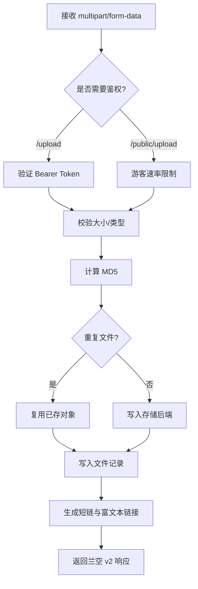

Kite 提供两个上传端点：

| 端点 | 认证 | 适用场景 |
|------|------|----------|
| `POST /api/v1/upload` | Bearer Token | 登录用户、API 客户端 |
| `POST /api/v1/public/upload` | 无 | 游客上传（需管理员开启） |

两者均使用 `multipart/form-data`，返回结构与**兰空 v2** 协议一致。

## 上传处理流程



## 登录用户上传

::endpoint
POST · `/api/v1/upload` · **需认证**
::

### 请求

```http
POST /api/v1/upload HTTP/1.1
Host: kite.your-domain.com
Authorization: Bearer YOUR_TOKEN
Content-Type: multipart/form-data; boundary=...

--boundary
Content-Disposition: form-data; name="file"; filename="photo.jpg"
Content-Type: image/jpeg

<file bytes>
--boundary
Content-Disposition: form-data; name="album_id"

album-uuid
--boundary--
```

| 字段 | 类型 | 必填 | 说明 |
|------|------|------|------|
| `file` | 文件 | ✓ | 上传的文件本体 |
| `album_id` | string | — | 归属相册的 UUID |

### 响应

```json
{
  "status": true,
  "message": "success",
  "data": {
    "key": "2026/04/a1b2c3d4/01234567-89ab.jpg",
    "name": "photo.jpg",
    "origin_name": "photo.jpg",
    "size": 245760,
    "mimetype": "image/jpeg",
    "extension": "jpg",
    "md5": "a1b2c3d4e5f6...",
    "links": {
      "url": "https://kite.your-domain.com/i/a1b2c3d4",
      "thumbnail_url": "https://kite.your-domain.com/t/a1b2c3d4",
      "markdown": "",
      "html": "",
      "bbcode": "[img]https://kite.your-domain.com/i/a1b2c3d4[/img]",
      "delete_url": "https://kite.your-domain.com/api/v1/files/<id>"
    }
  }
}
```

::note
**字段命名不同于其他接口**：`status` / `message` / `data` 来自兰空 v2 协议，便于 PicGo、兰空插件直接接入。
::

### 错误

| HTTP | Code | 含义 |
|------|------|------|
| `400` | `40000` | 未提交 `file` 字段 |
| `413` | `41300` | 文件超出 `max_file_size` |
| `415` | `41500` | 文件类型被禁止（`forbidden_exts` 或不在 `allowed_types` 中） |
| `507` | `50700` | 用户存储配额已满 |

## 游客上传

::endpoint
POST · `/api/v1/public/upload` · **无需认证**
::

仅当管理员开启 `allow_guest_upload` 时可用，并受**每分钟 10 次**的 IP 速率限制。

请求格式与登录上传相同，只是不需要 `Authorization` 头。上传文件归属虚拟用户 `guest`。

```bash
curl -X POST https://kite.your-domain.com/api/v1/public/upload \
  -F "file=@photo.png"
```

## 重复文件处理

Kite 上传时计算 MD5。当相同 MD5 的文件已存在：

| 设置 | 行为 |
|------|------|
| `allow_duplicate = false`（默认） | 复用已有存储文件，为当前用户创建一条新的**文件记录**，但**不重复写盘** |
| `allow_duplicate = true` | 每次都重新写入存储 |

这让团队内同一张图可以由多位用户各自「拥有」，同时不占用重复的存储空间。

## 文件访问短链

上传响应中的 `links` 基于请求的 `Host` 自动生成绝对路径。若在 CDN/反向代理后，**请确保**：

- Nginx 正确转发 `Host` 头
- 配置了 `X-Forwarded-Proto` 让 Kite 识别 HTTPS

否则可能生成错误的 scheme 或域名。

### 访问类型映射

上传时根据 MIME 自动判定：

| MIME 前缀 | file_type | 默认短链 |
|----------|-----------|---------|
| `image/*` | `image` | `/i/:hash` |
| `video/*` | `video` | `/v/:hash` |
| `audio/*` | `audio` | `/a/:hash` |
| 其他 | `file` | `/f/:hash`（下载） |

对所有类型，`/f/:hash` 均强制下载（`Content-Disposition: attachment`）。

## 存储路径

存储 key 由 [`path_pattern`](/docs/guide/configuration#上传) 生成，默认：

```
{year}/{month}/{md5_8}/{uuid}.{ext}
```

示例：`2026/04/a1b2c3d4/01234567-89ab-cdef-0123-456789abcdef.jpg`

此结构确保前缀分布均匀（对 S3 类存储友好），同时保留年月用于归档。

## 客户端示例

### curl

```bash
curl -X POST https://kite.your-domain.com/api/v1/upload \
  -H "Authorization: Bearer YOUR_TOKEN" \
  -F "file=@photo.png" \
  -F "album_id=optional-uuid"
```

### JavaScript (fetch)

```javascript
const form = new FormData()
form.append('file', fileInput.files[0])

const res = await fetch('https://kite.your-domain.com/api/v1/upload', {
  method: 'POST',
  headers: { Authorization: 'Bearer YOUR_TOKEN' },
  body: form,
})
const { data } = await res.json()
console.log(data.links.url)
```

### Python (requests)

```python
import requests

files = {'file': open('photo.png', 'rb')}
headers = {'Authorization': 'Bearer YOUR_TOKEN'}

r = requests.post(
    'https://kite.your-domain.com/api/v1/upload',
    headers=headers,
    files=files,
)
print(r.json()['data']['links']['url'])
```

### Go

```go
import (
    "bytes"
    "mime/multipart"
    "net/http"
    "os"
)

func upload(path, token string) (string, error) {
    f, _ := os.Open(path)
    defer f.Close()

    body := &bytes.Buffer{}
    w := multipart.NewWriter(body)
    fw, _ := w.CreateFormFile("file", path)
    io.Copy(fw, f)
    w.Close()

    req, _ := http.NewRequest("POST",
        "https://kite.your-domain.com/api/v1/upload", body)
    req.Header.Set("Authorization", "Bearer "+token)
    req.Header.Set("Content-Type", w.FormDataContentType())

    resp, err := http.DefaultClient.Do(req)
    // parse resp.Body...
}
```

## 下一步

- [文件管理](/docs/api/files) · 列表、删除、批量操作
- [第三方客户端](/docs/guide/clients) · PicGo 等工具集成
