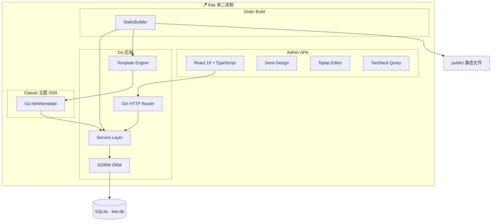

# 介绍

## 什么是 Kite？

**Kite** 是一个轻量级 AI 原生博客引擎，使用 Go + React + SQLite 构建，编译为单个可执行文件，拖到服务器即可运行。

Kite 的设计理念：

- **极简部署**：单二进制 + 单数据库文件，没有额外依赖
- **AI 原生**：内置 AI 摘要和标签推荐，对接 OpenAI/DeepSeek/Ollama
- **三种运行模式**：Headless（纯 API）、Classic（SSR）、Static Build（静态生成）自由选择
- **主题驱动**：基于 Go Template 的主题系统，一个 `templates/` 目录即为一套主题

## 核心特性

| 特性 | 说明 |
|------|------|
| 🚀 单二进制部署 | 前后端编译为一个可执行文件 |
| 📦 零配置启动 | 内嵌 SQLite，所有设置存储在数据库中 |
| 🌐 Web 安装向导 | 首次运行浏览器引导安装，无需配置文件 |
| 🎨 三种运行模式 | Headless (JSON API) / Classic (SSR) / Static Build (静态生成) |
| 🤖 AI 原生 | 一键对接 OpenAI / DeepSeek / Ollama |
| ✍️ Tiptap 编辑器 | Markdown / 所见即所得双模式 |
| 🖼️ 图片管理 | 封面上传、编辑器内拖拽粘贴自动上传 |
| 📡 RSS & Sitemap | 自动生成，SEO 友好 |
| 🎭 主题系统 | 自定义 Go Template 主题 |

## 架构

Kite 支持三种运行模式，覆盖从纯前后端分离到完全静态部署的所有场景：

| 模式 | 命令 | 适用场景 | 前端 | 部署方式 |
|------|------|----------|------|----------|
| **Headless** | `./kite` | 前后端分离、自定义前端 | 自带 React Admin + 自定义前端消费 API | 需运行 Go 后端 |
| **Classic SSR** | `./kite` | 传统博客、开箱即用 | Go Template 服务端渲染 | 需运行 Go 后端 |
| **Static Build** | `./kite build` | 纯静态托管、最高性能 | 预生成 HTML 文件 | GitHub Pages / Nginx / CDN |

## 技术栈

| 层级 | 技术 |
|------|------|
| 后端 | Go 1.22+, Gin |
| ORM | GORM |
| 数据库 | SQLite (glebarez/sqlite, 纯 Go) |
| 前端 | React 19, TypeScript, Vite |
| UI 组件库 | Semi Design (@douyinfe/semi-ui) |
| 富文本编辑器 | Tiptap (ProseMirror) |
| 数据获取 | TanStack Query |
| 模板引擎 | Go html/template |
| 认证 | Cookie Session + bcrypt |

## 项目链接

- **GitHub**: [https://github.com/amigoer/kite](https://github.com/amigoer/kite)
- **官网**: [https://www.kite.plus](https://www.kite.plus)
