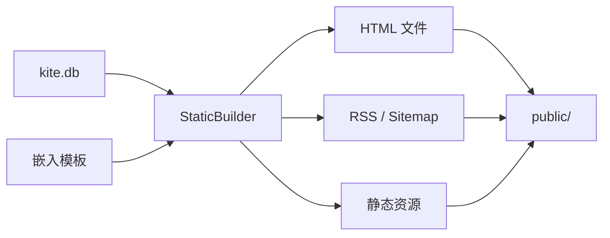

# 静态站点生成

Kite 内置了 `build` 子命令，可以将博客内容生成为纯静态 HTML 文件，无需运行 Go 后端即可部署到任意静态托管服务（如 GitHub Pages、Netlify、Cloudflare Pages、Vercel 等）。

## 基本使用

```bash
# 默认读取当前目录的 kite.db，输出到 public/
./kite build

# 自定义输出目录
./kite build -o dist

# 指定数据库文件
./kite build -db /path/to/kite.db

# 组合使用
./kite build -db /path/to/kite.db -o dist
```

## 命令参数

| 参数 | 默认值 | 说明 |
|------|--------|------|
| `-o` | `public` | 输出目录路径 |
| `-db` | `kite.db` | SQLite 数据库文件路径 |

## 生成内容

执行 `kite build` 后，会在输出目录中生成以下文件：

| 内容 | 输出路径 | 说明 |
|------|----------|------|
| 首页 | `index.html` | 文章列表首页 |
| 首页分页 | `page/{n}/index.html` | 首页翻页 |
| 文章详情 | `posts/{slug}/index.html` | 每篇已发布文章 |
| 分类归档 | `categories/{slug}/index.html` | 按分类筛选的文章列表，支持分页 |
| 标签归档 | `tags/{slug}/index.html` | 按标签筛选的文章列表，支持分页 |
| 独立页面 | `pages/{slug}/index.html` | 自定义独立页面 |
| 友情链接 | `friends/index.html` | 友链页面 |
| 404 页面 | `404.html` | 自定义 404 页 |
| RSS | `feed.xml` | RSS 2.0 订阅源（最新 20 篇文章） |
| Sitemap | `sitemap.xml` | 站点地图，包含所有文章和页面 |
| 静态资源 | `static/*` | 主题中的 CSS、JS、图片等资源 |

## 工作原理



Build 命令的执行流程：

1. 从 SQLite 数据库加载所有站点设置（站点名称、描述、URL 等）
2. 使用编译时嵌入的 `templates/` 模板文件
3. 通过 Service 层查询所有已发布的文章、页面、分类、标签等数据
4. 使用 Go `html/template` 渲染模板为 HTML，写入输出目录
5. 生成 RSS 和 Sitemap XML 文件
6. 复制主题中的静态资源（CSS/JS/图片）

::: tip 复用现有代码
Build 命令直接复用了 Kite 的 `repo`/`service` 层读取数据，使用与 SSR 相同的模板引擎渲染，确保输出结果与在线渲染完全一致。
:::

## 部署示例

### GitHub Pages

```yaml
# .github/workflows/deploy.yml
name: Deploy to GitHub Pages

on:
  push:
    branches: [main]

jobs:
  build:
    runs-on: ubuntu-latest
    steps:
      - uses: actions/checkout@v4

      - name: Build static site
        run: ./kite build -o public

      - name: Deploy
        uses: peaceiris/actions-gh-pages@v4
        with:
          github_token: ${{ secrets.GITHUB_TOKEN }}
          publish_dir: ./public
```

### Nginx

```nginx
server {
    listen 80;
    server_name example.com;
    root /var/www/blog;

    # 自定义 404 页面
    error_page 404 /404.html;

    location / {
        try_files $uri $uri/ =404;
    }
}
```

## 注意事项

- 生成前会**清空输出目录**，请勿将重要文件放在输出目录中
- 站点 URL 等配置从数据库设置中读取，请确保在管理后台中正确配置了**站点地址**
- 独立页面会根据其模板设置（`default`、`about` 等）选择对应的模板文件渲染
- 每页文章数量由数据库中的 `posts_per_page` 设置决定，默认为 10
